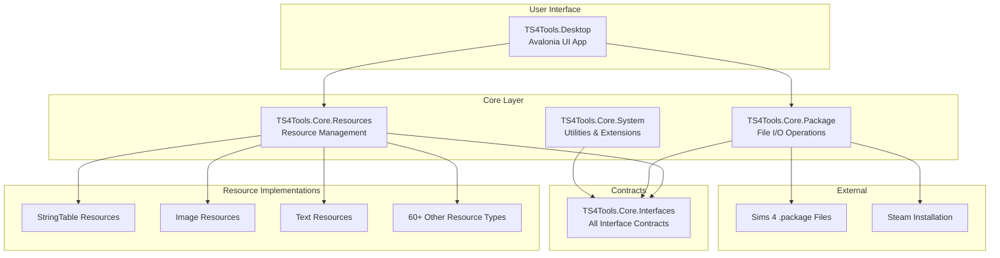
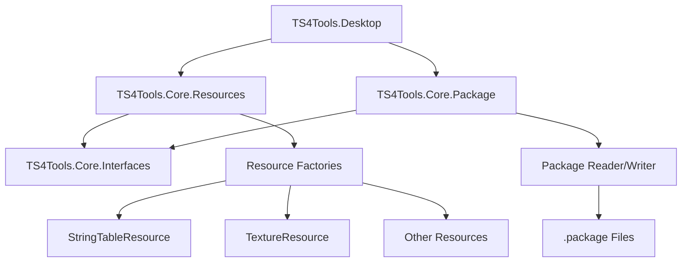
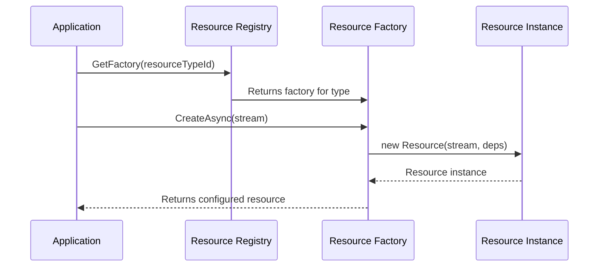
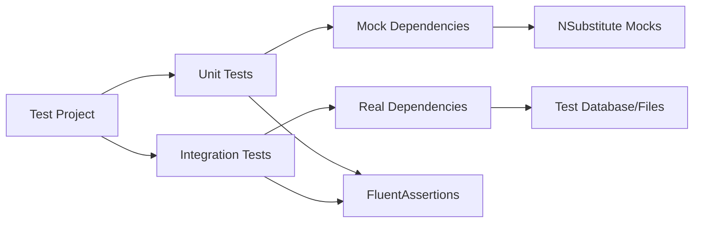
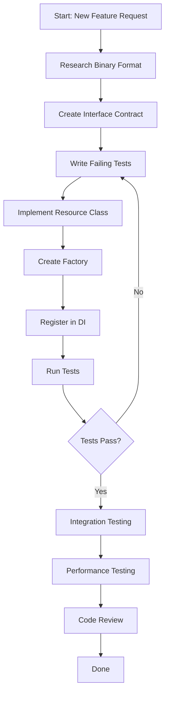
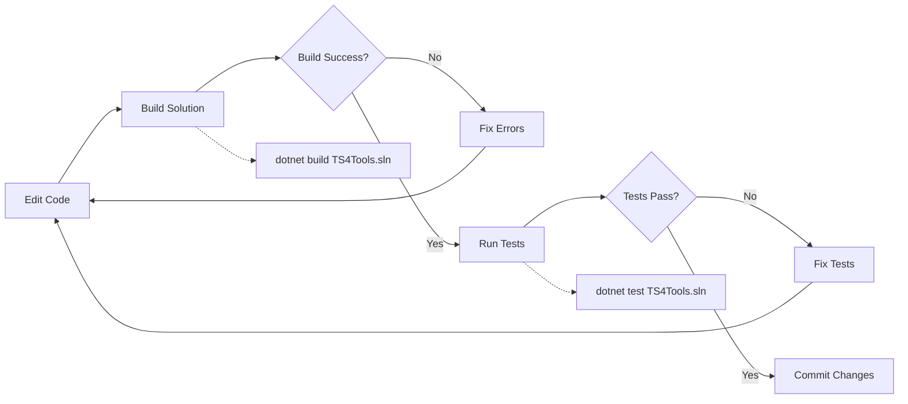

# TS4Tools Developer Onboarding Guide

**Welcome to the TS4Tools Development Team!**

This guide will help you understand the TS4Tools codebase, learn how to create tests,
and contribute new features. It's designed for entry-level C# engineers who want to
become productive contributors to this Sims 4 modding tools project.

## What You'll Learn

1. **Codebase Architecture** - How the project is organized and key patterns
2. **Development Setup** - Getting your environment ready for coding
3. **Creating Tests** - Our testing patterns and how to write effective tests
4. **Adding Features** - Step-by-step guide to implementing new functionality
5. **Code Standards** - Conventions and best practices we follow
6. **Common Tasks** - Practical examples of typical development work

> **IMPORTANT NOTE**: This project has multiple .sln files! Always use `TS4Tools.sln` for all dotnet commands.

### Overall Architecture Overview



---

## [QUICK START] Get Running in 10 minutes

### Prerequisites

- **Windows 10/11** (primary development platform)
- **Visual Studio 2022** (v17.9+) or **VS Code** with C# extension
- **.NET 9 SDK** (latest version)
- **Git** for version control

### Get the Code Running

```powershell
# 1. Clone and build (IMPORTANT: Always specify the solution file)
git clone https://github.com/nawglan/TS4Tools.git
cd TS4Tools
dotnet restore TS4Tools.sln
dotnet build TS4Tools.sln

# 2. Run tests to verify everything works
dotnet test TS4Tools.sln

# 3. Start the desktop application
dotnet run --project TS4Tools.Desktop/TS4Tools.Desktop.csproj
```

**Success indicators:**

- [X] Clean build with no errors
- [X] Tests passing (95%+ success rate is normal)  
- [X] Desktop application opens

---

## [CODEBASE] Understanding the Structure

### Project Structure

```text
TS4Tools/
+-- src/                           # All source code lives here
|   +-- TS4Tools.Core.Interfaces/  # Contracts (what classes must implement)
|   +-- TS4Tools.Core.System/      # Basic utilities and helpers
|   +-- TS4Tools.Core.Package/     # Reading/writing Sims 4 .package files
|   +-- TS4Tools.Core.Resources/   # Managing different types of game content
|   +-- TS4Tools.Resources.*/      # Specific resource implementations
|   +-- TS4Tools.Desktop/          # The main UI application
+-- tests/                         # All test code
+-- docs/                          # Documentation (like this guide!)
+-- scripts/                       # Build and utility scripts
```

### How Components Work Together



### Key Concepts You Need to Know

#### 1. What are "Resources"?

In Sims 4, everything is a **resource** - textures, 3D models, text strings, animations, etc.
Each resource has:
- A **Type ID** (like 0x220557DA for text strings)
- **Data** (the actual content)
- **Metadata** (size, version, etc.)

#### 2. The Factory Pattern

We use the Factory Pattern to create resources:

```csharp
// Instead of: new TextureResource()
// We use: await textureFactory.CreateAsync(stream)

public interface IResourceFactory<T>
{
    Task<T> CreateAsync(Stream data);
}
```

**Factory Pattern Flow:**



**Why?** It allows us to:

- Inject dependencies (logging, configuration, etc.)
- Handle different versions of the same resource type
- Make testing easier with mock factories

#### 3. Dependency Injection (DI)

We use Microsoft's DI container to provide dependencies:

```csharp
// Instead of creating dependencies directly:
public class BadExample
{
    public void ProcessFile()
    {
        var logger = new FileLogger("app.log");     // Hard to test
        var reader = new FileReader();              // Tightly coupled
    }
}

// We inject them through the constructor:
public class GoodExample
{
    private readonly ILogger<GoodExample> _logger;
    private readonly IFileReader _reader;

    public GoodExample(ILogger<GoodExample> logger, IFileReader reader)
    {
        _logger = logger;
        _reader = reader;
    }
}
```

#### 4. Async/Await Pattern

File operations are async to keep the UI responsive:

```csharp
// File operations use async
public async Task<IPackage> LoadPackageAsync(string filePath)
{
    using var stream = await File.OpenReadAsync(filePath);
    return await _packageFactory.CreateAsync(stream);
}
```

---

## [TESTING] Creating Tests

### Test Structure (AAA Pattern)

All tests follow **Arrange, Act, Assert**:

```csharp
[Test]
public async Task LoadPackage_WithValidFile_ReturnsPackage()
{
    // Arrange - Set up test data
    var filePath = "test-data/valid-package.package";
    var loader = new PackageLoader(_mockLogger.Object);

    // Act - Execute the code being tested
    var result = await loader.LoadPackageAsync(filePath);

    // Assert - Verify the results
    result.Should().NotBeNull();
    result.ResourceCount.Should().Be(42);
}
```

### Test Architecture Overview



### Types of Tests We Write

#### 1. Unit Tests
Test a single class in isolation:

```csharp
public class StringTableResourceTests
{
    private readonly ILogger<StringTableResource> _mockLogger;

    public StringTableResourceTests()
    {
        _mockLogger = Substitute.For<ILogger<StringTableResource>>();
    }

    [Test]
    public void Constructor_WithValidStream_ParsesStrings()
    {
        // Arrange
        var testData = CreateTestStringTableData();
        using var stream = new MemoryStream(testData);

        // Act
        var resource = new StringTableResource(1, stream, _mockLogger);

        // Assert
        resource.Strings.Should().HaveCount(3);
        resource.Strings["HELLO"].Should().Be("Hello World");
    }
}
```

#### 2. Integration Tests
Test multiple components working together:

```csharp
[Test]
public async Task PackageLoader_WithRealFile_LoadsAllResources()
{
    // Arrange
    var packagePath = "test-data/real-sims4-package.package";
    var serviceCollection = new ServiceCollection();
    serviceCollection.AddTS4ToolsServices(); // Our DI setup
    var serviceProvider = serviceCollection.BuildServiceProvider();
    
    var loader = serviceProvider.GetRequiredService<IPackageLoader>();

    // Act
    var package = await loader.LoadAsync(packagePath);

    // Assert
    package.Resources.Should().NotBeEmpty();
    // Verify specific resource types were loaded correctly
    package.GetResourcesOfType<IStringTableResource>().Should().NotBeEmpty();
}
```

### Test Data Management

We store test files in `test-data/` directories:

```
tests/
├── TS4Tools.Tests/
│   ├── test-data/
│   │   ├── valid-package.package
│   │   ├── corrupted-package.package
│   │   └── string-table-samples/
│   └── StringTableResourceTests.cs
```

### Writing Good Test Names

Use descriptive names that explain the scenario:

```csharp
// ✅ Good - explains what's being tested and expected outcome
[Test]
public void ParseStringTable_WithMissingHashKey_ThrowsInvalidDataException()

// ❌ Bad - unclear what this tests
[Test]
public void TestStringTable()
```

### Using FluentAssertions

We use FluentAssertions for readable test assertions:

```csharp
// [GOOD] Fluent and readable
result.Should().NotBeNull();
result.Count.Should().BeGreaterThan(0);
result.Should().Contain(item => item.Name == "expected-name");

// [AVOID] Traditional asserts (less readable)
Assert.NotNull(result);
Assert.True(result.Count > 0);
Assert.True(result.Any(item => item.Name == "expected-name"));
```

---

## [FEATURES] Adding New Features

### Feature Development Workflow



### Step-by-Step Guide: Adding a New Resource Type

Let's walk through adding support for a new resource type: `MoodletResource`.

#### Step 1: Define the Interface

Create the contract that defines what a Moodlet resource can do:

```csharp
// File: src/TS4Tools.Core.Interfaces/Resources/IMoodletResource.cs
public interface IMoodletResource : IResource
{
    string MoodletName { get; }
    string Description { get; }
    int Duration { get; }
    MoodletType Type { get; }
}

public enum MoodletType
{
    Positive,
    Negative,
    Neutral
}
```

#### Step 2: Create the Implementation

```csharp
// File: src/TS4Tools.Resources.Gameplay/MoodletResource.cs
public class MoodletResource : ResourceBase, IMoodletResource
{
    private readonly ILogger<MoodletResource> _logger;

    public string MoodletName { get; private set; } = string.Empty;
    public string Description { get; private set; } = string.Empty;
    public int Duration { get; private set; }
    public MoodletType Type { get; private set; }

    public MoodletResource(int apiVersion, Stream? stream, ILogger<MoodletResource> logger)
        : base(apiVersion)
    {
        _logger = logger ?? throw new ArgumentNullException(nameof(logger));
        
        if (stream != null)
        {
            ParseMoodletData(stream);
        }
    }

    private void ParseMoodletData(Stream stream)
    {
        using var reader = new BinaryReader(stream);
        
        // Read the binary format (you'll need to research the actual format)
        var nameLength = reader.ReadInt32();
        MoodletName = Encoding.UTF8.GetString(reader.ReadBytes(nameLength));
        
        var descLength = reader.ReadInt32();
        Description = Encoding.UTF8.GetString(reader.ReadBytes(descLength));
        
        Duration = reader.ReadInt32();
        Type = (MoodletType)reader.ReadByte();

        _logger.LogDebug("Parsed moodlet: {Name} ({Type}), Duration: {Duration}",
            MoodletName, Type, Duration);
    }
}
```

#### Step 3: Create the Factory

```csharp
// File: src/TS4Tools.Resources.Gameplay/MoodletResourceFactory.cs
public class MoodletResourceFactory : ResourceFactoryBase<IMoodletResource>
{
    // This tells the system which resource type IDs this factory handles
    public override IReadOnlySet<string> SupportedResourceTypes =>
        new HashSet<string> { "0x12345678" }; // Replace with actual moodlet type ID

    protected override async Task<IMoodletResource> CreateResourceCoreAsync(
        int apiVersion,
        Stream? stream,
        CancellationToken cancellationToken)
    {
        // We don't actually need async here, but the interface requires it
        await Task.CompletedTask;
        
        return new MoodletResource(apiVersion, stream, _logger);
    }
}
```

#### Step 4: Register in Dependency Injection

```csharp
// File: src/TS4Tools.Resources.Gameplay/ServiceCollectionExtensions.cs
public static class ServiceCollectionExtensions
{
    public static IServiceCollection AddGameplayResources(this IServiceCollection services)
    {
        services.AddResourceFactory<IMoodletResource, MoodletResourceFactory>();
        return services;
    }
}
```

#### Step 5: Write Tests First (TDD)

```csharp
// File: tests/TS4Tools.Resources.Gameplay.Tests/MoodletResourceTests.cs
public class MoodletResourceTests
{
    private readonly ILogger<MoodletResource> _mockLogger;

    public MoodletResourceTests()
    {
        _mockLogger = Substitute.For<ILogger<MoodletResource>>();
    }

    [Test]
    public void Constructor_WithValidStream_ParsesMoodletData()
    {
        // Arrange
        var testData = CreateTestMoodletData();
        using var stream = new MemoryStream(testData);

        // Act
        var moodlet = new MoodletResource(1, stream, _mockLogger);

        // Assert
        moodlet.MoodletName.Should().Be("Happy");
        moodlet.Description.Should().Be("This Sim is feeling happy!");
        moodlet.Duration.Should().Be(240); // 4 hours in minutes
        moodlet.Type.Should().Be(MoodletType.Positive);
    }

    [Test]
    public void Constructor_WithNullStream_CreatesEmptyMoodlet()
    {
        // Act
        var moodlet = new MoodletResource(1, null, _mockLogger);

        // Assert
        moodlet.MoodletName.Should().BeEmpty();
        moodlet.Description.Should().BeEmpty();
        moodlet.Duration.Should().Be(0);
        moodlet.Type.Should().Be(MoodletType.Neutral);
    }

    private byte[] CreateTestMoodletData()
    {
        using var stream = new MemoryStream();
        using var writer = new BinaryWriter(stream);

        // Write test data in the expected binary format
        var nameBytes = Encoding.UTF8.GetBytes("Happy");
        writer.Write(nameBytes.Length);
        writer.Write(nameBytes);

        var descBytes = Encoding.UTF8.GetBytes("This Sim is feeling happy!");
        writer.Write(descBytes.Length);
        writer.Write(descBytes);

        writer.Write(240); // Duration
        writer.Write((byte)MoodletType.Positive); // Type

        return stream.ToArray();
    }
}
```

### Requirements for New Features

#### Before Starting Development

1. **Research the Format**: Understand the binary structure of the resource
   - Use hex editors to examine real game files
   - Document the byte structure in comments
   - Check existing similar resources for patterns

2. **Create Test Data**: Build sample files that represent typical usage
   - Valid data for happy path testing
   - Edge cases (empty strings, maximum values)
   - Invalid data for error handling testing

3. **Check Dependencies**: Identify what services your feature needs
   - Logging (always include)
   - Configuration settings
   - Other resource types it might reference

#### During Development

1. **Write Tests First**: Follow TDD principles
   - Start with simple constructor tests
   - Add parsing tests with real data
   - Test error conditions

2. **Use Dependency Injection**: Never create dependencies directly
   - Inject through constructor
   - Use interfaces, not concrete types
   - Register in ServiceCollectionExtensions

3. **Follow Coding Standards**: Maintain consistency
   - Use async for file operations
   - Add XML documentation to public members
   - Follow naming conventions
   - Include proper error handling

#### After Implementation

1. **Integration Testing**: Test with real game files
2. **Performance Testing**: Ensure acceptable performance
3. **Documentation**: Update API docs and examples
4. **Code Review**: Have another developer review your changes

---

## [STANDARDS] Code Standards and Conventions

### Naming Conventions

```csharp
// Interfaces: PascalCase with 'I' prefix
public interface IResourceFactory<T> { }

// Classes: PascalCase
public class StringTableResource { }

// Methods: PascalCase
public async Task LoadAsync() { }

// Private fields: camelCase with underscore prefix
private readonly ILogger _logger;

// Properties: PascalCase
public string ResourceName { get; set; }

// Local variables: camelCase
var resourceCount = 42;

// Constants: PascalCase
public const int MaxFileSize = 1024 * 1024;
```

### Error Handling Patterns

```csharp
// [GOOD] Specific exceptions with helpful messages
public void ValidateResourceType(uint typeId)
{
    if (typeId == 0)
        throw new ArgumentException("Resource type ID cannot be zero", nameof(typeId));
        
    if (!IsValidResourceType(typeId))
        throw new NotSupportedException($"Resource type 0x{typeId:X8} is not supported");
}

// [GOOD] Async error handling
public async Task<IResource> LoadResourceAsync(string path)
{
    try
    {
        using var stream = await File.OpenReadAsync(path);
        return await _factory.CreateAsync(stream);
    }
    catch (FileNotFoundException)
    {
        _logger.LogWarning("Resource file not found: {Path}", path);
        throw;
    }
    catch (Exception ex)
    {
        _logger.LogError(ex, "Failed to load resource from {Path}", path);
        throw new ResourceLoadException($"Cannot load resource from {path}", ex);
    }
}
```

### Documentation Standards

Add XML documentation to all public APIs:

```csharp
/// <summary>
/// Loads a Sims 4 package file and returns all contained resources.
/// </summary>
/// <param name="filePath">Path to the .package file to load</param>
/// <param name="cancellationToken">Token to cancel the operation</param>
/// <returns>A package containing all loaded resources</returns>
/// <exception cref="FileNotFoundException">Thrown when the package file doesn't exist</exception>
/// <exception cref="InvalidDataException">Thrown when the file is not a valid package</exception>
public async Task<IPackage> LoadPackageAsync(string filePath, CancellationToken cancellationToken = default)
{
    // Implementation here
}
```

### Modern C# Features We Use

```csharp
// Records for immutable data
public record ResourceKey(uint Type, uint Group, ulong Instance);

// Pattern matching
public string GetResourceDescription(IResource resource) => resource switch
{
    IStringTableResource str => $"String table with {str.Count} entries",
    ITextureResource tex => $"Texture {tex.Width}x{tex.Height}",
    _ => "Unknown resource type"
};

// Nullable reference types
public IResource? FindResource(string? name)
{
    if (string.IsNullOrEmpty(name))
        return null;
        
    return _resources.FirstOrDefault(r => r.Name == name);
}

// Using declarations for automatic disposal
public async Task ProcessFileAsync(string path)
{
    using var stream = File.OpenRead(path);
    await ProcessStreamAsync(stream);
} // stream is automatically disposed here
```

---

## [TASKS] Common Development Tasks

### IMPORTANT: Always Specify the Solution File

**This project has multiple solution files!** Always specify `TS4Tools.sln`:

```powershell
# CORRECT - Always specify the solution file
dotnet build TS4Tools.sln
dotnet test TS4Tools.sln
dotnet restore TS4Tools.sln

# WRONG - Will build the wrong solution or fail
dotnet build
dotnet test
```

### Development Workflow Diagram



### Finding Examples in the Codebase

When you need to understand how something works, look at existing implementations:

```powershell
# Find all resource implementations
grep -r "class.*Resource.*:" src/ --include="*.cs"

# Find factory examples
grep -r "ResourceFactory" src/ --include="*.cs"

# Look for test examples
grep -r "public.*Test" tests/ --include="*.cs"
```

### Adding a New Service to DI

1. Create the interface:
```csharp
public interface IMyService
{
    Task<string> ProcessAsync(string input);
}
```

2. Create the implementation:
```csharp
public class MyService : IMyService
{
    private readonly ILogger<MyService> _logger;
    
    public MyService(ILogger<MyService> logger)
    {
        _logger = logger;
    }
    
    public async Task<string> ProcessAsync(string input)
    {
        _logger.LogDebug("Processing input: {Input}", input);
        // Implementation here
        return await Task.FromResult($"Processed: {input}");
    }
}
```

3. Register in DI:
```csharp
// In ServiceCollectionExtensions.cs
services.AddScoped<IMyService, MyService>();
```

### Debugging Tips

#### Use the Debugger Effectively

1. Set breakpoints on exception catches to see what's failing
2. Use conditional breakpoints for loops: `item.Name == "specific-name"`
3. Use the "Locals" window to inspect object state

#### Logging for Development

```csharp
_logger.LogDebug("Loading resource {Type} from {Path}", resourceType, filePath);
_logger.LogInformation("Successfully loaded {Count} resources", resources.Count);
_logger.LogWarning("Resource {Name} has invalid data, using defaults", resourceName);
_logger.LogError(ex, "Failed to process resource {Type}", resourceType);
```

#### Common Issues and Solutions

**Problem**: Tests fail with NullReferenceException
**Solution**: Check that all dependencies are properly mocked in test setup

**Problem**: DI container can't resolve service
**Solution**: Verify service is registered in ServiceCollectionExtensions.cs

**Problem**: File loading fails
**Solution**: Check file paths are absolute and files exist in test-data directories

---

## 🎯 What to Focus On

### For Your First Week

1. **Explore the codebase** - Open files, read code, understand the structure
2. **Run existing tests** - See how tests are written and what they verify
3. **Make a small change** - Fix a typo, add a log message, improve a comment
4. **Write a simple test** - Pick an existing class and add a new test case

### For Your First Month

1. **Implement a simple resource type** - Start with something straightforward
2. **Add comprehensive tests** - Practice the testing patterns we use
3. **Understand the factory pattern** - This is central to how resources work
4. **Get comfortable with async/await** - Most operations are asynchronous

### For Your First Three Months

1. **Contribute to complex features** - Take on larger implementation tasks
2. **Review others' code** - Help maintain code quality
3. **Improve documentation** - Help future developers (like this guide!)
4. **Optimize performance** - Identify and fix bottlenecks

---

## [HELP] Getting Help

### Where to Look First

1. **This documentation** - Start with the docs in the `docs/` folder
2. **Existing code** - Look for similar implementations
3. **Tests** - They show how code is supposed to be used
4. **Git history** - See how features were implemented previously

### How to Ask for Help

When you're stuck, provide context:

1. **What you're trying to do** - "I'm implementing a new resource type"
2. **What you've tried** - "I followed the pattern from StringTableResource"
3. **What's happening** - "Tests pass but the resource doesn't load correctly"
4. **Error messages** - Include full stack traces
5. **Code samples** - Show the specific code that's not working

### Code Review Guidelines

When your code is ready for review:

1. **Self-review first** - Read through your own changes
2. **Write clear commit messages** - Explain what and why
3. **Include tests** - Don't submit code without tests
4. **Update documentation** - If you changed public APIs
5. **Keep changes focused** - One feature per pull request

---

## [READY] You're Ready to Start

By now you should understand:

- [X] How the TS4Tools codebase is organized
- [X] Our development patterns (DI, factories, async)
- [X] How to write tests using our testing standards
- [X] The step-by-step process for adding new features
- [X] Our code standards and conventions
- [X] How to get help when you need it

**Next Steps:**

1. Set up your development environment
2. Run the existing tests to make sure everything works
3. Pick a small task from the issue tracker
4. Start coding!

Welcome to the team!
