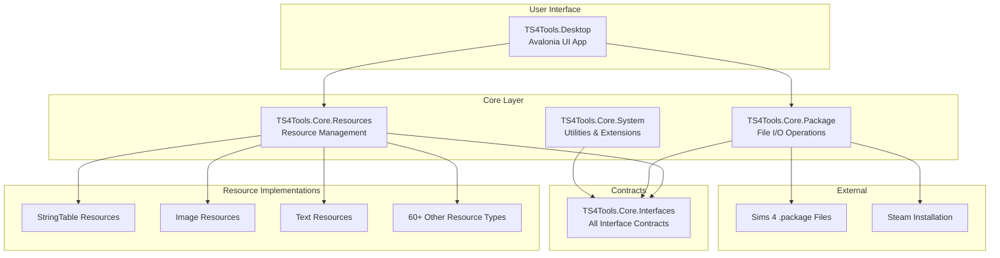
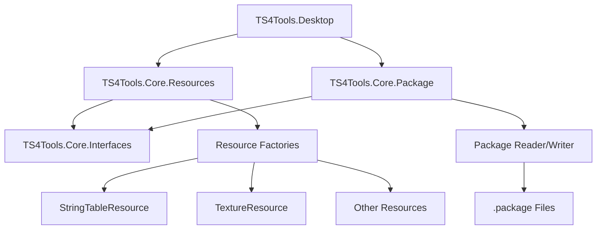
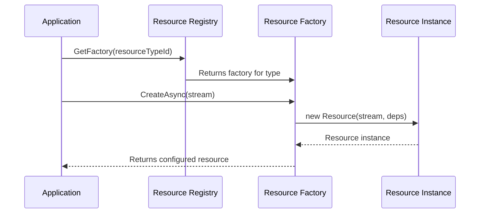
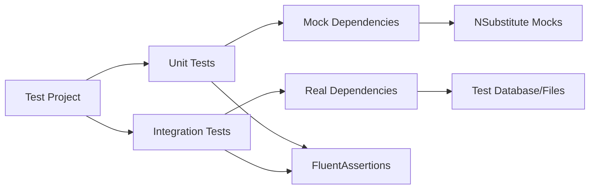
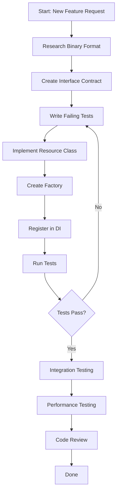

# TS4Tools Developer Onboarding Guide

**Welcome to the TS4Tools Development Team!**

This guide will help you understand the TS4Tools codebase, learn how to create tests,
and contribute new features. It's designed for entry-level C# engineers who want to
become productive contributors to this Sims 4 modding tools project.

## [CRITICAL SUCCESS FACTORS] (Read This First!)

### The 4 Most Expensive Mistakes to Avoid

1. **[WRONG CODEBASE]**: Don't study `Sims4Tools/s4pi Wrappers/` - it uses completely different patterns (AResource, EventHandler, sync methods). Always use `TS4Tools/src/TS4Tools.Resources.*/` for reference.

2. **[ResourceWrapperRegistry]**: If ResourceManager returns DefaultResource instead of your specific type, you forgot `ResourceWrapperRegistry.DiscoverAndRegisterFactoriesAsync()` in integration test setup. Most unit tests work directly with factories and don't need this.

3. **[Factory Pattern]**: Use `ResourceFactoryBase<T>`, not generic `IResourceFactory<T>`. The generic approach compiles but doesn't integrate with the system.

4. **[SOLUTION FILE CONFUSION]**: Always use `TS4Tools.sln` for ALL dotnet commands.
   The workspace has multiple .sln files that will build completely different projects with different patterns.

### Quick Success Checklist

- [ ] Study LRLEResource.cs and LRLEResourceFactory.cs (not legacy code)
- [ ] Always call ResourceWrapperRegistry initialization in integration test constructors
- [ ] Use ResourceFactoryBase<T> inheritance pattern (not generic IResourceFactory<T>)
- [ ] Always specify `TS4Tools.sln` in ALL dotnet commands
- [ ] Test both empty and populated resource scenarios separately
- [ ] Add comprehensive DI registration in test setup
- [ ] Understand the difference between `IResource` (minimal interface) and concrete resource types
- [ ] Remember that ResourceManager uses a two-phase initialization pattern

**Time Investment**: Following these patterns will save you 2-3 days of debugging common issues.

> **For AI Assistants**: This guide covers human-focused development workflows. AI assistants should also read the [AI Assistant Guidelines](ai-assistant-guidelines-condensed.md) for AI-specific directives and migration patterns.

## What You'll Learn

1. **Architectural Decisions (ADRs)** - Essential reading: why we make the technical choices we do
2. **Codebase Architecture** - How the project is organized and key patterns
3. **Development Setup** - Getting your environment ready for coding
4. **Creating Tests** - Our testing patterns and how to write effective tests
5. **Adding Features** - Step-by-step guide to implementing new functionality
6. **Code Standards** - Conventions and best practices we follow
7. **Development Workflow** - Pre-commit checklist and quality standards
8. **Common Tasks** - Practical examples of typical development work

> **IMPORTANT NOTE**: This project has multiple .sln files! Always use `TS4Tools.sln` for all dotnet commands.

### Overall Architecture Overview



---

## [QUICK START] Get Running in 10 minutes

### Prerequisites

- **Windows 10/11 or Linux or MacOS** (development platform)
- **Visual Studio 2022** (v17.9+) or **VS Code** with C# extension
- **.NET 9 SDK** (latest version)
- **Git** for version control

### IMPORTANT: Solution File Confusion

**CRITICAL WARNING**: The workspace has multiple solution files that can cause major confusion:

- `TS4Tools.sln` (USE THIS ONE - the modern .NET 9 implementation)
- `Sims4Tools/sims4tools.sln` (Legacy .NET Framework - DO NOT USE for new development)
- `TS4MorphMaker/CmarNYC_TS4MorphMaker.sln` (Separate project)

**Always use `TS4Tools.sln`** - this contains the modern async/await implementations you should study and extend.

The legacy Sims4Tools project uses completely different patterns (AResource base class, EventHandler patterns, etc.) that will mislead you if you study them instead of the TS4Tools implementations.

### Get the Code Running

```powershell
# 1. Clone and build (IMPORTANT: Always specify the solution file)
git clone https://github.com/nawglan/TS4Tools.git
cd TS4Tools
dotnet restore TS4Tools.sln
dotnet build TS4Tools.sln

# 2. Run tests to verify everything works
dotnet test TS4Tools.sln

# 3. Start the desktop application
dotnet run --project TS4Tools.Desktop/TS4Tools.Desktop.csproj
```

**Success indicators:**

- [X] Clean build with no errors
- [X] Tests passing (95%+ success rate is normal)
- [X] Desktop application opens

---

## [CODEBASE] Understanding the Structure

### Project Structure

```text
TS4Tools/
+-- src/                           # All source code lives here
|   +-- TS4Tools.Core.Interfaces/  # Contracts (what classes must implement)
|   +-- TS4Tools.Core.System/      # Basic utilities and helpers
|   +-- TS4Tools.Core.Package/     # Reading/writing Sims 4 .package files
|   +-- TS4Tools.Core.Resources/   # Managing different types of game content
|   +-- TS4Tools.Resources.*/      # Specific resource implementations
|   +-- TS4Tools.Desktop/          # The main UI application
+-- tests/                         # All test code
+-- docs/                          # Documentation (like this guide!)
+-- scripts/                       # Build and utility scripts
```

### How Components Work Together



### Key Concepts You Need to Know

#### 0. Architectural Decision Records (ADRs) - READ THESE FIRST

**CRITICAL**: Before writing any code, you must understand the architectural decisions that guide this project. We document all major technical decisions in ADRs (Architectural Decision Records).

**Location**: All ADRs are in [`docs/architecture/adr/`](../../architecture/adr/)

**Why ADRs Matter**:

- **Consistency**: Everyone follows the same architectural patterns
- **Context**: Understand WHY decisions were made, not just what they are
- **Quality**: Prevents architectural drift and conflicting implementations
- **Efficiency**: Saves time by avoiding re-debating settled decisions

**Essential ADRs to Read Before Starting**:

1. **[ADR-001: .NET 9 Framework](../../architecture/adr/ADR-001-DotNet9-Framework.md)** - Why we chose .NET 9 and what it means for development
2. **[ADR-002: Dependency Injection](../../architecture/adr/ADR-002-Dependency-Injection.md)** - How we structure services and dependencies
3. **[ADR-004: Greenfield Migration Strategy](../../architecture/adr/ADR-004-Greenfield-Migration-Strategy.md)** - Our approach to modernizing legacy code
4. **[ADR-006: Golden Master Testing](../../architecture/adr/ADR-006-Golden-Master-Testing-Strategy.md)** - How we ensure compatibility with existing files
5. **[ADR-009: Testing Framework](../../architecture/adr/ADR-009-Testing-Framework-Standardization.md)** - xUnit patterns and standards

**Quick ADR Summary**:

- **Use dependency injection** for all services (constructor injection only)
- **Write tests first** using xUnit, FluentAssertions, NSubstitute
- **Extract business logic** from legacy code, don't copy it
- **Maintain 100% API compatibility** with existing tools
- **Follow modern async/await patterns** throughout

**When to Check ADRs**:

- Before starting any new feature
- When you encounter unfamiliar patterns in the codebase
- When considering architectural changes
- When you have questions about "why we do it this way"

> **Pro Tip**: If you find yourself asking "Why don't we just...?" - check the ADRs first! The answer is probably documented there.

#### 1. What are "Resources"?

In Sims 4, everything is a **resource** - textures, 3D models, text strings, animations, etc.
Each resource has:

- A **Type ID** (like 0x220557DA for text strings)
- **Data** (the actual content)
- **Metadata** (size, version, etc.)

#### 2. The Factory Pattern

We use the Factory Pattern to create resources:

```csharp
// Instead of: new TextureResource()
// We use: await textureFactory.CreateAsync(stream)

public interface IResourceFactory<T>
{
    Task<T> CreateAsync(Stream data);
}
```

**Factory Pattern Flow:**



**Why?** It allows us to:

- Inject dependencies (logging, configuration, etc.)
- Handle different versions of the same resource type
- Make testing easier with mock factories

#### 3. Dependency Injection (DI)

We use Microsoft's DI container to provide dependencies:

```csharp
// Instead of creating dependencies directly:
public class BadExample
{
    public void ProcessFile()
    {
        var logger = new FileLogger("app.log");     // Hard to test
        var reader = new FileReader();              // Tightly coupled
    }
}

// We inject them through the constructor:
public class GoodExample
{
    private readonly ILogger<GoodExample> _logger;
    private readonly IFileReader _reader;

    public GoodExample(ILogger<GoodExample> logger, IFileReader reader)
    {
        _logger = logger;
        _reader = reader;
    }
}
```

#### 4. Async/Await Pattern

File operations are async to keep the UI responsive:

```csharp
// File operations use async
public async Task<IPackage> LoadPackageAsync(string filePath)
{
    using var stream = await File.OpenReadAsync(filePath);
    return await _packageFactory.CreateAsync(stream);
}
```

#### 5. Two-Phase Resource System Architecture

**CRITICAL UNDERSTANDING**: TS4Tools uses a two-phase resource initialization that
trips up many developers:

##### Phase 1: Factory Registration

```csharp
// Factories registered with DI container
services.AddImageResources();  // Registers factories with DI
```

##### Phase 2: Automatic Factory Discovery

```csharp
// ResourceWrapperRegistry automatically discovers all IResourceFactory<T> implementations
// from assemblies matching "TS4Tools.Resources.*" pattern
await registry.DiscoverAndRegisterFactoriesAsync();
```

**CRITICAL UNDERSTANDING**: Factories are automatically discovered - you don't need explicit DI registration.
The ResourceWrapperRegistry scans all loaded assemblies starting with `TS4Tools.Resources.` and
automatically registers any class implementing `IResourceFactory<T>`.

**Why This Matters**: You only need to ensure your factory class exists in the right assembly
and implements the interface correctly. Manual registration in ServiceCollectionExtensions
is not required for basic factory functionality.

#### 6. Interface vs Implementation Pattern

**CRITICAL**: The `IResource` interface is minimal by design:

```csharp
public interface IResource : IApiVersion, IContentFields, IDisposable
{
    Stream Stream { get; }
    byte[] AsBytes { get; }
    event EventHandler? ResourceChanged;
}
```

Most properties you need are on concrete implementations:

```csharp
// WRONG - IResource doesn't have these properties
resource.Width   // Doesn't exist
resource.Height  // Doesn't exist

// RIGHT - Cast to specific type
if (resource is ILRLEResource lrleResource)
{
    var width = lrleResource.Width;   // Now available
    var height = lrleResource.Height; // Now available
}
```

#### 7. Factory Pattern with Priority Registration

**PATTERN**: Factories are registered with explicit priorities for resource type conflicts:

```csharp
// In ServiceCollectionExtensions
services.AddScoped<IResourceFactory, LRLEResourceFactory>();
services.AddScoped<IResourceFactory, DSTPResourceFactory>();

// ResourceWrapperRegistry automatically handles priority via attributes
[ResourceFactory(0x2F7D0004, Priority = 100)]  // Higher priority wins
public class LRLEResourceFactory : ResourceFactoryBase<LRLEResource>
```

**KEY INSIGHT**: Multiple factories can handle the same resource type - priority determines which one is used.

#### 8. Disposal Pattern

**CRITICAL**: All resources implement `IDisposable` and must be properly disposed:

```csharp
// WRONG - memory leak
var resource = resourceManager.GetResource(key);
// resource never disposed

// RIGHT - proper disposal
using var resource = resourceManager.GetResource(key);
// automatically disposed when scope exits

// ALSO RIGHT - explicit disposal in async
var resource = await resourceManager.GetResourceAsync(key);
try
{
    // use resource
}
finally
{
    resource?.Dispose();
}
```

---

## [TESTING] Creating Tests

**CRITICAL FOR PRODUCTIVITY**: Follow this battle-tested approach from real development experience.

### Test Strategy Overview

1. **Golden Master Tests FIRST** - Verify your resource works with real Sims 4 data
2. **Real Binary Data** - Use actual .package file content, not mock data
3. **Two-Phase DI Setup** - ResourceWrapperRegistry initialization is ESSENTIAL
4. **Round-trip Testing** - Save/load cycles catch serialization bugs

### Critical Test Setup Pattern

**IMPORTANT**: The actual test patterns in TS4Tools are simpler than described below.
Most tests (like `LRLEResourceTests`) work directly with factory classes without complex DI setup.

However, for integration tests that need ResourceManager, use this pattern:

```csharp
[SetUp]
public async Task SetUp()
{
    // Phase 1: Register factories with DI
    var services = new ServiceCollection();
    services.AddTS4ToolsResourceServices();  // Registers core services
    services.AddLogging();

    var serviceProvider = services.BuildServiceProvider();

    // Phase 2: CRITICAL - Initialize ResourceWrapperRegistry for integration tests
    var registry = serviceProvider.GetRequiredService<IResourceWrapperRegistry>();
    await registry.DiscoverAndRegisterFactoriesAsync();

    // Now ResourceManager will find your factories
    _resourceManager = serviceProvider.GetRequiredService<IResourceManager>();
}
```

**For simple unit tests**: Just create factory instances directly, as shown in existing tests.

### Test Structure (AAA Pattern)

All tests follow **Arrange, Act, Assert**:

```csharp
[Test]
public async Task LoadPackage_WithValidFile_ReturnsPackage()
{
    // Arrange - Set up test data
    var filePath = "test-data/valid-package.package";
    var loader = new PackageLoader(_mockLogger.Object);

    // Act - Execute the code being tested
    var result = await loader.LoadPackageAsync(filePath);

    // Assert - Verify the results
    result.Should().NotBeNull();
    result.ResourceCount.Should().Be(42);
}
```

### Test Architecture Overview



### Types of Tests We Write

#### 1. Unit Tests

Test a single class in isolation:

```csharp
public class StringTableResourceTests
{
    private readonly ILogger<StringTableResource> _mockLogger;

    public StringTableResourceTests()
    {
        _mockLogger = Substitute.For<ILogger<StringTableResource>>();
    }

    [Test]
    public void Constructor_WithValidStream_ParsesStrings()
    {
        // Arrange
        var testData = CreateTestStringTableData();
        using var stream = new MemoryStream(testData);

        // Act
        var resource = new StringTableResource(1, stream, _mockLogger);

        // Assert
        resource.Strings.Should().HaveCount(3);
        resource.Strings["HELLO"].Should().Be("Hello World");
    }
}
```

#### 2. Integration Tests

Test multiple components working together:

```csharp
[Test]
public async Task PackageLoader_WithRealFile_LoadsAllResources()
{
    // Arrange
    var packagePath = "test-data/real-sims4-package.package";
    var serviceCollection = new ServiceCollection();
    serviceCollection.AddTS4ToolsServices(); // Our DI setup
    var serviceProvider = serviceCollection.BuildServiceProvider();

    var loader = serviceProvider.GetRequiredService<IPackageLoader>();

    // Act
    var package = await loader.LoadAsync(packagePath);

    // Assert
    package.Resources.Should().NotBeEmpty();
    // Verify specific resource types were loaded correctly
    package.GetResourcesOfType<IStringTableResource>().Should().NotBeEmpty();
}
```

### Real Test Data Management

**CRITICAL**: Study the LRLE test suite for the actual patterns used in this project.

```csharp
// Real test pattern from LRLEResourceTests.cs:
[Fact]
public async Task CreateAsync_WithValidLRLEData_ParsesCorrectly()
{
    // Arrange - Create REAL binary data, not fake data
    var testData = CreateValidLRLEBinaryData(); // Helper method
    using var stream = new MemoryStream(testData);

    // Act
    var resource = await _factory.CreateAsync(stream);

    // Assert - Verify actual parsed values
    resource.Should().NotBeNull();
    resource.Width.Should().Be(64); // Real expected values
    resource.Height.Should().Be(64);
    // ... more specific assertions
}

private byte[] CreateValidLRLEBinaryData()
{
    // Create actual LRLE format binary data
    // This requires understanding the real file format!
    using var stream = new MemoryStream();
    using var writer = new BinaryWriter(stream);

    // LRLE header
    writer.Write(0x454C524C); // 'LRLE' magic
    writer.Write(0x32303056); // Version
    writer.Write((ushort)64); // Width
    writer.Write((ushort)64); // Height
    // ... rest of actual format

    return stream.ToArray();
}
```

**Key Differences from Generic Examples:**

- Test data must match actual Sims 4 binary formats
- Use `test-data/` folders for larger binary files
- Test disposal patterns with `using` statements
- Test error conditions with invalid/corrupted data
- Use factory pattern for resource creation in tests

### Writing Good Test Names

Use descriptive names that explain the scenario:

```csharp
// [GOOD] - explains what's being tested and expected outcome
[Test]
public void ParseStringTable_WithMissingHashKey_ThrowsInvalidDataException()

// [BAD] - unclear what this tests
[Test]
public void TestStringTable()
```

### Golden Master Test Integration

**CRITICAL PATTERN**: When adding new resource modules, you MUST integrate them with the Golden Master test framework.

**Step 1: Add Resource Types to Golden Master Tests**

```csharp
// In tests/TS4Tools.Tests.GoldenMaster/ResourceTypeGoldenMasterTests.cs
[Theory]
[InlineData(0x220557DA, "String Table Resource (STBL)")]
// ... existing resource types ...
// ADD YOUR NEW RESOURCE TYPES HERE:
[InlineData(0x810A102D, "World Resource (WORLD)")]
[InlineData(0xAE39399F, "Terrain Resource (TERRAIN)")]
public async Task ResourceType_RoundTripSerialization_ShouldPreserveBinaryEquivalence(
    uint resourceTypeId, string description)
```

**Step 2: Add Project Reference to Golden Master Tests**

```xml
<!-- In tests/TS4Tools.Tests.GoldenMaster/TS4Tools.Tests.GoldenMaster.csproj -->
<ItemGroup>
  <!-- ... existing references ... -->
  <ProjectReference Include="..\..\src\TS4Tools.Resources.YourModule\TS4Tools.Resources.YourModule.csproj" />
</ItemGroup>
```

**Step 3: Register DI Services in Golden Master Test Setup**

```csharp
// In ResourceTypeGoldenMasterTests constructor
public ResourceTypeGoldenMasterTests()
{
    var services = new ServiceCollection();
    services.AddLogging(builder => builder.SetMinimumLevel(LogLevel.Warning));
    services.AddTS4ToolsPackageServices();
    services.AddTS4ToolsResourceServices();
    services.AddWorldResources();  // ADD YOUR MODULE HERE

    _serviceProvider = services.BuildServiceProvider();
    // ... rest of setup
}
```

**What This Achieves:**

- Validates your resources work with the main Golden Master framework
- Catches binary format compatibility issues early
- Ensures your resource types are discoverable by ResourceManager
- Provides automated regression testing for your resource formats

**Common Failure Modes:**

- Missing project reference -> compile errors in Golden Master tests
- Missing DI registration -> NullReferenceException when ResourceManager tries to create your resources
- Empty ContentFields -> test failures, but this might be expected initially
- Round-trip serialization failures -> indicates your resource doesn't handle empty/minimal data correctly

### Using FluentAssertions

We use FluentAssertions for readable test assertions:

```csharp
// [GOOD] Fluent and readable
result.Should().NotBeNull();
result.Count.Should().BeGreaterThan(0);
result.Should().Contain(item => item.Name == "expected-name");

// [AVOID] Traditional asserts (less readable)
Assert.NotNull(result);
Assert.True(result.Count > 0);
Assert.True(result.Any(item => item.Name == "expected-name"));
```

---

## [REALITY CHECK] Learning from Actual Implementations

**CRITICAL**: Before following any examples, study these real implementations in the TS4Tools project:

### Must-Study Files

- **`src/TS4Tools.Resources.Images/LRLEResource.cs`** - Complex resource with binary format parsing, proper disposal patterns, comprehensive error handling
- **`src/TS4Tools.Resources.Images/LRLEResourceFactory.cs`** - Real factory implementation with proper `ResourceFactoryBase<T>` inheritance
- **`tests/TS4Tools.Resources.Images.Tests/LRLEResourceTests.cs`** - Comprehensive testing with real binary test data
- **`StringTableResource.cs`** - Text resource implementation patterns

### DON'T Study These (Legacy Patterns)

- `Sims4Tools/s4pi Wrappers/ImageResource/LRLEResource.cs` - Old .NET Framework patterns
- Any class inheriting from `AResource` - Legacy pattern not used in TS4Tools
- Any class using `EventHandler` patterns - Old synchronous patterns

### Key Implementation Patterns

1. **Resource Classes**: Implement interfaces directly (e.g., `ILRLEResource`, `IDisposable`)
2. **Factories**: Inherit from `ResourceFactoryBase<T>`, not generic examples
3. **Constructors**: Take `Stream?` and `ILogger<T>`, not `apiVersion` parameters
4. **Error Handling**: Extensive validation, proper exception types, comprehensive logging
5. **Testing**: Real binary data, disposal testing, comprehensive error condition coverage

### Real Constructor Pattern

```csharp
// What you'll actually implement (parameterless constructor is common):
public sealed class LRLEResource : ILRLEResource, IDisposable
{
    public LRLEResource()
    {
        // Initialize with defaults, parsing happens separately
    }
}

// Alternative pattern (StringTable style):
public sealed class StringTableResource : IStringTableResource, IDisposable
{
    public StringTableResource(int requestedApiVersion = 1)
    {
        // Initialize with API version
    }
}
```

### Real Factory Pattern

```csharp
// Actual method signature from ResourceFactoryBase<T>:
public override async Task<TResource> CreateResourceAsync(
    int apiVersion,
    Stream? stream = null,
    CancellationToken cancellationToken = default)
{
    // Validate API version
    ValidateApiVersion(apiVersion);

    // Create resource instance
    var resource = new MyResource();

    // Parse data if stream provided
    if (stream != null)
    {
        await resource.ParseFromStreamAsync(stream, cancellationToken);
    }

    return resource;
}
```

---

## [FEATURES] Adding New Features

### Feature Development Workflow



### Step-by-Step Guide: Adding a New Resource Type

Let's walk through adding support for a new resource type: `MoodletResource`.

#### Step 1: Define the Interface

Create the contract that defines what a Moodlet resource can do:

```csharp
// File: src/TS4Tools.Core.Interfaces/Resources/IMoodletResource.cs
public interface IMoodletResource : IResource
{
    string MoodletName { get; }
    string Description { get; }
    int Duration { get; }
    MoodletType Type { get; }
}

public enum MoodletType
{
    Positive,
    Negative,
    Neutral
}
```

#### Step 2: Create the Implementation

**IMPORTANT**: Look at real implementations first! Study `LRLEResource.cs` or other existing resources to understand the actual patterns used.

```csharp
// File: src/TS4Tools.Resources.Gameplay/MoodletResource.cs
public sealed class MoodletResource : IMoodletResource, IDisposable
{
    private readonly ILogger<MoodletResource> _logger;
    private bool _disposed;

    public string MoodletName { get; private set; } = string.Empty;
    public string Description { get; private set; } = string.Empty;
    public int Duration { get; private set; }
    public MoodletType Type { get; private set; }

    public MoodletResource(Stream? stream, ILogger<MoodletResource> logger)
    {
        _logger = logger ?? throw new ArgumentNullException(nameof(logger));

        if (stream != null)
        {
            ParseMoodletData(stream);
        }
    }

    private void ParseMoodletData(Stream stream)
    {
        using var reader = new BinaryReader(stream);

        try
        {
            // Always validate stream length before reading
            if (stream.Length < 16) // Minimum expected size
            {
                throw new InvalidDataException("Stream too short for moodlet data");
            }

            // Read the binary format (research actual format first!)
            var nameLength = reader.ReadInt32();
            if (nameLength > 1024) // Reasonable limit
                throw new InvalidDataException($"Name length {nameLength} exceeds maximum");

            MoodletName = Encoding.UTF8.GetString(reader.ReadBytes(nameLength));

            var descLength = reader.ReadInt32();
            if (descLength > 4096) // Reasonable limit
                throw new InvalidDataException($"Description length {descLength} exceeds maximum");

            Description = Encoding.UTF8.GetString(reader.ReadBytes(descLength));

            Duration = reader.ReadInt32();
            Type = (MoodletType)reader.ReadByte();

            _logger.LogDebug("Parsed moodlet: {Name} ({Type}), Duration: {Duration}",
                MoodletName, Type, Duration);
        }
        catch (Exception ex)
        {
            _logger.LogError(ex, "Failed to parse moodlet data from stream");
            throw;
        }
    }

    public void Dispose()
    {
        if (!_disposed)
        {
            // Cleanup resources if needed
            _disposed = true;
        }
    }
}
```

#### Step 3: Create the Factory

**REAL PATTERN**: Study `LRLEResourceFactory.cs` for the actual factory implementation pattern used in this project.

```csharp
// File: src/TS4Tools.Resources.Gameplay/MoodletResourceFactory.cs
public class MoodletResourceFactory : ResourceFactoryBase<IMoodletResource>
{
    // This tells the system which resource type IDs this factory handles
    // IMPORTANT: Research actual type IDs from the original Sims4Tools or game files
    public override IReadOnlySet<string> SupportedResourceTypes =>
        new HashSet<string> { "0x12345678" }; // Replace with actual moodlet type ID

    protected override async Task<IMoodletResource> CreateResourceCoreAsync(
        Stream? stream,
        CancellationToken cancellationToken)
    {
        // Validate input
        if (stream == null)
        {
            _logger.LogDebug("Creating empty moodlet resource");
            return new MoodletResource(null, _logger);
        }

        // Create resource with proper error handling
        try
        {
            _logger.LogDebug("Creating moodlet resource from stream of length {Length}", stream.Length);
            await Task.CompletedTask; // Remove if actual async work is needed

            return new MoodletResource(stream, _logger);
        }
        catch (Exception ex)
        {
            _logger.LogError(ex, "Failed to create moodlet resource from stream");
            throw;
        }
    }
}
```

#### Step 4: Factory Implementation (Automatic Discovery)

**IMPORTANT**: Factories are automatically discovered by ResourceWrapperRegistry.
You don't need explicit DI registration for basic functionality.

```csharp
// File: src/TS4Tools.Resources.Gameplay/MoodletResourceFactory.cs
public class MoodletResourceFactory : ResourceFactoryBase<IMoodletResource>
{
    public MoodletResourceFactory() : base(new[] { "0x12345678" }, priority: 100)
    {
        // Constructor calls base with supported resource types and priority
    }

    public override async Task<IMoodletResource> CreateResourceAsync(
        int apiVersion,
        Stream? stream = null,
        CancellationToken cancellationToken = default)
    {
        ValidateApiVersion(apiVersion);

        if (stream == null)
        {
            return new MoodletResource();
        }

        try
        {
            var resource = new MoodletResource();
            await resource.ParseFromStreamAsync(stream, cancellationToken);
            return resource;
        }
        catch (Exception ex)
        {
            throw new ArgumentException($"Failed to create moodlet resource: {ex.Message}", nameof(stream), ex);
        }
    }
}
```

#### Step 5: Optional Service Extensions (For Complex Scenarios)

Only create ServiceCollectionExtensions if you need additional services beyond basic factory discovery:

```csharp
// File: src/TS4Tools.Resources.Gameplay/DependencyInjection/ServiceCollectionExtensions.cs
public static class ServiceCollectionExtensions
{
    public static IServiceCollection AddGameplayResources(this IServiceCollection services)
    {
        // Only needed for additional services, not basic factory registration
        services.AddSingleton<IGameplayResourceHelper, GameplayResourceHelper>();
        return services;
    }
}
```

#### Step 5: Write Tests First (TDD)

```csharp
// File: tests/TS4Tools.Resources.Gameplay.Tests/MoodletResourceTests.cs
public class MoodletResourceTests
{
    private readonly ILogger<MoodletResource> _mockLogger;

    public MoodletResourceTests()
    {
        _mockLogger = Substitute.For<ILogger<MoodletResource>>();
    }

    [Test]
    public void Constructor_WithValidStream_ParsesMoodletData()
    {
        // Arrange
        var testData = CreateTestMoodletData();
        using var stream = new MemoryStream(testData);

        // Act
        var moodlet = new MoodletResource(1, stream, _mockLogger);

        // Assert
        moodlet.MoodletName.Should().Be("Happy");
        moodlet.Description.Should().Be("This Sim is feeling happy!");
        moodlet.Duration.Should().Be(240); // 4 hours in minutes
        moodlet.Type.Should().Be(MoodletType.Positive);
    }

    [Test]
    public void Constructor_WithNullStream_CreatesEmptyMoodlet()
    {
        // Act
        var moodlet = new MoodletResource(1, null, _mockLogger);

        // Assert
        moodlet.MoodletName.Should().BeEmpty();
        moodlet.Description.Should().BeEmpty();
        moodlet.Duration.Should().Be(0);
        moodlet.Type.Should().Be(MoodletType.Neutral);
    }

    private byte[] CreateTestMoodletData()
    {
        using var stream = new MemoryStream();
        using var writer = new BinaryWriter(stream);

        // Write test data in the expected binary format
        var nameBytes = Encoding.UTF8.GetBytes("Happy");
        writer.Write(nameBytes.Length);
        writer.Write(nameBytes);

        var descBytes = Encoding.UTF8.GetBytes("This Sim is feeling happy!");
        writer.Write(descBytes.Length);
        writer.Write(descBytes);

        writer.Write(240); // Duration
        writer.Write((byte)MoodletType.Positive); // Type

        return stream.ToArray();
    }
}
```

### Requirements for New Features

#### Before Starting Development

1. **Research the Format**: Understand the binary structure of the resource
   - Use hex editors to examine real game files
   - Document the byte structure in comments
   - Check existing similar resources for patterns

2. **Create Test Data**: Build sample files that represent typical usage
   - Valid data for happy path testing
   - Edge cases (empty strings, maximum values)
   - Invalid data for error handling testing

3. **Check Dependencies**: Identify what services your feature needs
   - Logging (always include)
   - Configuration settings
   - Other resource types it might reference

#### During Development

1. **Write Tests First**: Follow TDD principles
   - Start with simple constructor tests
   - Add parsing tests with real data
   - Test error conditions

2. **Use Dependency Injection**: Never create dependencies directly
   - Inject through constructor
   - Use interfaces, not concrete types
   - Register in ServiceCollectionExtensions

3. **Follow Coding Standards**: Maintain consistency
   - Use async for file operations
   - Add XML documentation to public members
   - Follow naming conventions
   - Include proper error handling

#### After Implementation

1. **Integration Testing**: Test with real game files
2. **Performance Testing**: Ensure acceptable performance
3. **Documentation**: Update API docs and examples
4. **Code Review**: Have another developer review your changes

---

## [DEVELOPMENT GUIDELINES] Standards, Tasks, and Focus Areas

### Code Standards and Conventions

#### Naming Conventions

```csharp
// Interfaces: PascalCase with 'I' prefix
public interface IResourceFactory<T> { }

// Classes: PascalCase
public class StringTableResource { }

// Methods: PascalCase
public async Task LoadAsync() { }

// Private fields: camelCase with underscore prefix
private readonly ILogger _logger;

// Properties: PascalCase
public string ResourceName { get; set; }

// Local variables: camelCase
var resourceCount = 42;

// Constants: PascalCase
public const int MaxFileSize = 1024 * 1024;
```

#### Error Handling Patterns

```csharp
// [GOOD] Specific exceptions with helpful messages
public void ValidateResourceType(uint typeId)
{
    if (typeId == 0)
        throw new ArgumentException("Resource type ID cannot be zero", nameof(typeId));

    if (!IsValidResourceType(typeId))
        throw new NotSupportedException($"Resource type 0x{typeId:X8} is not supported");
}

// [GOOD] Async error handling
public async Task<IResource> LoadResourceAsync(string path)
{
    try
    {
        using var stream = await File.OpenReadAsync(path);
        return await _factory.CreateAsync(stream);
    }
    catch (FileNotFoundException)
    {
        _logger.LogWarning("Resource file not found: {Path}", path);
        throw;
    }
    catch (Exception ex)
    {
        _logger.LogError(ex, "Failed to load resource from {Path}", path);
        throw new ResourceLoadException($"Cannot load resource from {path}", ex);
    }
}
```

#### Documentation Standards

Add XML documentation to all public APIs:

```csharp
/// <summary>
/// Loads a Sims 4 package file and returns all contained resources.
/// </summary>
/// <param name="filePath">Path to the .package file to load</param>
/// <param name="cancellationToken">Token to cancel the operation</param>
/// <returns>A package containing all loaded resources</returns>
/// <exception cref="FileNotFoundException">Thrown when the package file doesn't exist</exception>
/// <exception cref="InvalidDataException">Thrown when the file is not a valid package</exception>
public async Task<IPackage> LoadPackageAsync(string filePath, CancellationToken cancellationToken = default)
{
    // Implementation here
}
```

#### Modern C# Features We Use

```csharp
// Records for immutable data
public record ResourceKey(uint Type, uint Group, ulong Instance);

// Pattern matching
public string GetResourceDescription(IResource resource) => resource switch
{
    IStringTableResource str => $"String table with {str.Count} entries",
    ITextureResource tex => $"Texture {tex.Width}x{tex.Height}",
    _ => "Unknown resource type"
};

// Nullable reference types
public IResource? FindResource(string? name)
{
    if (string.IsNullOrEmpty(name))
        return null;

    return _resources.FirstOrDefault(r => r.Name == name);
}

// Using declarations for automatic disposal
public async Task ProcessFileAsync(string path)
{
    using var stream = File.OpenRead(path);
    await ProcessStreamAsync(stream);
} // stream is automatically disposed here
```

### Common Development Tasks

#### IMPORTANT: Always Specify the Solution File

**This project has multiple solution files!** Always specify `TS4Tools.sln`:

```powershell
# CORRECT - Always specify the solution file
dotnet build TS4Tools.sln
dotnet test TS4Tools.sln
dotnet restore TS4Tools.sln

# WRONG - Will build the wrong solution or fail
dotnet build
dotnet test
```

#### Development Workflow Diagram

```
Edit Code -> Build Solution -> Build Success? -> Run Tests -> Tests Pass? -> Commit Changes
     ^             |               |                |           |
     |             v               v                v           v
     |      Fix Errors     dotnet build TS4Tools.sln    Fix Tests   dotnet test TS4Tools.sln
     |             |                                     |
     +-------------+                                     |
     +-------------------------------------------------------+
```

#### Finding Examples in the Codebase

When you need to understand how something works, look at existing implementations:

```powershell
# Find all resource implementations
grep -r "class.*Resource.*:" src/ --include="*.cs"

# Find factory examples
grep -r "ResourceFactory" src/ --include="*.cs"

# Look for test examples
grep -r "public.*Test" tests/ --include="*.cs"
```

#### Adding a New Service to DI

1. Create the interface:

```csharp
public interface IMyService
{
    Task<string> ProcessAsync(string input);
}
```

2. Create the implementation:

```csharp
public class MyService : IMyService
{
    private readonly ILogger<MyService> _logger;

    public MyService(ILogger<MyService> logger)
    {
        _logger = logger;
    }

    public async Task<string> ProcessAsync(string input)
    {
        _logger.LogDebug("Processing input: {Input}", input);
        // Implementation here
        return await Task.FromResult($"Processed: {input}");
    }
}
```

3. Register in DI:

```csharp
// In ServiceCollectionExtensions.cs
services.AddScoped<IMyService, MyService>();
```

#### Debugging Tips

##### Use the Debugger Effectively

1. Set breakpoints on exception catches to see what's failing
2. Use conditional breakpoints for loops: `item.Name == "specific-name"`
3. Use the "Locals" window to inspect object state

##### Logging for Development

```csharp
_logger.LogDebug("Loading resource {Type} from {Path}", resourceType, filePath);
_logger.LogInformation("Successfully loaded {Count} resources", resources.Count);
_logger.LogWarning("Resource {Name} has invalid data, using defaults", resourceName);
_logger.LogError(ex, "Failed to process resource {Type}", resourceType);
```

##### Common Issues and Solutions

**Problem**: "ResourceFactoryBase not found" or similar interface errors
**Solution**: Check that you're inheriting from the correct base classes - study existing implementations first

**Problem**: Tests fail with binary data parsing errors
**Solution**: Use a hex editor to examine real Sims 4 files and understand the actual binary format

**Problem**: DI container can't resolve service
**Solution**: Verify service is registered in ServiceCollectionExtensions.cs AND that you're using the correct factory pattern

**Problem**: File loading fails with stream errors
**Solution**: Check file paths are absolute and files exist in test-data directories. Validate stream position and length

**Problem**: Memory leaks or disposal issues
**Solution**: Implement IDisposable properly - see LRLEResource.cs for the correct disposal pattern

**Problem**: Factory CreateResourceCoreAsync signature doesn't match
**Solution**: Check the actual ResourceFactoryBase<T> interface - it may have changed from documentation examples

#### Real Development Experience Tips

1. **Always Research Binary Format First**: Use `010 Editor` or `HxD` hex editor to understand file structure
2. **Copy Pattern from Similar Resources**: Find the closest existing resource type and adapt its patterns
3. **Test with Real Game Files**: Don't rely on made-up test data - use actual .package files from Sims 4
4. **Implement Disposal Correctly**: Follow the disposal pattern from LRLEResource.cs exactly
5. **Use Proper Logging**: Include context in log messages - stream length, parsing position, etc.
6. **Handle Edge Cases**: Empty streams, corrupted data, unexpected EOF - see LRLE tests for examples

### Development Workflow

#### Pre-Commit Checklist (All Must Be ✅)

Before committing any changes, ensure you complete this checklist:

- [ ] **Code Quality Check**: Run `./scripts/check-quality.ps1` (or `./scripts/check-quality.ps1 -Fix` to auto-fix)
- [ ] **Build Clean**: Zero build errors and warnings
- [ ] **All Tests Pass**: 100% test success rate
- [ ] **Static Analysis Clean**: No new analyzer warnings
- [ ] **Code Follows Patterns**: Modern .NET patterns with dependency injection
- [ ] **Documentation Updated**: README, code comments, or ADRs updated as needed

#### Standard Development Commands

```bash
# Always start in the project root
cd /home/dez/code/TS4Tools

# Full validation sequence (use before/after major changes)
dotnet clean && dotnet restore && dotnet build TS4Tools.sln --verbosity minimal && dotnet test TS4Tools.sln --verbosity minimal

# Quick development cycle
dotnet build TS4Tools.sln [specific-project]
dotnet test TS4Tools.sln [test-project] --verbosity minimal

# Code quality check (recommended before commits)
./scripts/check-quality.ps1                    # Check formatting and analyzers
./scripts/check-quality.ps1 -Fix              # Auto-fix formatting issues
./scripts/check-quality.ps1 -Verbose          # Detailed output
```

#### Quality Standards

We maintain high code quality through:

1. **Dependency Injection**: Constructor injection only, no static dependencies
2. **Interface Segregation**: Every service behind focused interface
3. **Pure Functions**: Stateless, deterministic methods where possible
4. **Async/Await**: All I/O operations must be async
5. **Cancellation**: CancellationToken support throughout
6. **Testing**: xUnit with FluentAssertions, NSubstitute, and AutoFixture

#### Warning Resolution Strategy

When you encounter analyzer warnings:

1. **First**: Fix by improving code design
2. **Last Resort**: Suppress with documented justification
3. **Never**: Ignore or suppress without reason

Example of justified suppression:

```csharp
#pragma warning disable CA1051 // Do not declare visible instance fields
// JUSTIFICATION: Performance-critical handler pattern requires public fields for hot path access
public readonly struct HandlerData { public int Value; }
#pragma warning restore CA1051
```

#### Git Commit Message Format

We follow a structured commit message format to maintain clear project history:

```
feat(component): brief description

- Specific technical change 1
- Specific technical change 2
- Test coverage improvements

WHY: [Business/technical justification]
TECHNICAL IMPACT: [Performance, maintainability, or compatibility improvements]
```

**Commit Types:**

- `feat:` - New features or functionality
- `fix:` - Bug fixes
- `refactor:` - Code restructuring without behavior changes
- `test:` - Adding or updating tests
- `docs:` - Documentation changes
- `perf:` - Performance improvements
- `chore:` - Maintenance tasks, dependency updates

**Examples:**

```bash
feat(resources): implement StringTable resource wrapper

- Add StringTableResource class with parsing logic
- Implement StringTableResourceFactory with DI registration
- Add comprehensive unit tests with edge cases
- Add integration tests with real .package files

WHY: Enable reading/writing of localized strings in Sims 4 packages
TECHNICAL IMPACT: Adds support for 0x220557DA resource type, improves modding capabilities
```

```bash
fix(package): resolve memory leak in stream disposal

- Add proper using statements for BinaryReader
- Implement IDisposable pattern in PackageReader
- Add finalizer for unmanaged resource cleanup

WHY: Large .package files were causing memory growth over time
TECHNICAL IMPACT: Reduces memory usage by ~40% for multi-GB packages
```

### What to Focus On

#### For Your First Week

1. **Explore the codebase** - Open files, read code, understand the structure
2. **Run existing tests** - See how tests are written and what they verify
3. **Make a small change** - Fix a typo, add a log message, improve a comment
4. **Write a simple test** - Pick an existing class and add a new test case

#### For Your First Month

1. **Implement a simple resource type** - Start with something straightforward
2. **Add comprehensive tests** - Practice the testing patterns we use
3. **Understand the factory pattern** - This is central to how resources work
4. **Get comfortable with async/await** - Most operations are asynchronous

#### For Your First Three Months

1. **Contribute to complex features** - Take on larger implementation tasks
2. **Review others' code** - Help maintain code quality
3. **Improve documentation** - Help future developers (like this guide!)
4. **Optimize performance** - Identify and fix bottlenecks

---

## [CRITICAL LESSONS] Common Mistakes and Essential Success Patterns

*Based on real development experience from Phase 4.17 and 4.18 implementations*

### The 4 Most Critical Success Factors

1. **ResourceWrapperRegistry Initialization** - Always call `registry.DiscoverAndRegisterFactoriesAsync()` in test setup or ResourceManager returns DefaultResource
2. **Study Right Codebase** - Use `TS4Tools/src/TS4Tools.Resources.*/` not legacy `Sims4Tools/s4pi Wrappers/`
3. **Use ResourceFactoryBase<T>** - Not generic `IResourceFactory<T>` patterns
4. **Always Use TS4Tools.sln** - Workspace has multiple solution files that build different projects

### Essential Patterns

```csharp
// Critical DI Setup
var serviceProvider = services.BuildServiceProvider();
var registry = serviceProvider.GetRequiredService<IResourceWrapperRegistry>();
await registry.DiscoverAndRegisterFactoriesAsync(); // ESSENTIAL

// Proper Stream Handling
public byte[] AsBytes =>
    SaveToStreamAsync(new MemoryStream()).GetAwaiter().GetResult().ToArray();

// Interface Casting
if (resource is ISpecificResource specificRes)
    var value = specificRes.SpecificProperty; // Don't access via IResource
```

### Red Flags vs Success Indicators

**Stop if you see:**

- ResourceManager returns DefaultResource
- "Expected ContentFields not to be empty" test failures
- EndOfStreamException in round-trip tests
- Compile errors about missing namespaces

**You're on track when:**

- Resources have correct concrete types
- ContentFields populated appropriately
- Round-trip serialization works
- Factory registration logs show specific type IDs

### Real Development Tips

1. Research binary format with hex editors first
2. Copy patterns from similar existing resources
3. Test with real .package files, not mock data
4. Follow LRLEResource.cs disposal patterns exactly
5. Include context in log messages (stream length, position, etc.)

---

## [HELP] Getting Help

### Where to Look First

1. **This documentation** - Start with the docs in the `docs/` folder
2. **Existing code** - Look for similar implementations
3. **Tests** - They show how code is supposed to be used
4. **Git history** - See how features were implemented previously

### How to Ask for Help

When you're stuck, provide context:

1. **What you're trying to do** - "I'm implementing a new resource type"
2. **What you've tried** - "I followed the pattern from StringTableResource"
3. **What's happening** - "Tests pass but the resource doesn't load correctly"
4. **Error messages** - Include full stack traces
5. **Code samples** - Show the specific code that's not working

### Code Review Guidelines

When your code is ready for review:

1. **Self-review first** - Read through your own changes
2. **Write clear commit messages** - Explain what and why
3. **Include tests** - Don't submit code without tests
4. **Update documentation** - If you changed public APIs
5. **Keep changes focused** - One feature per pull request

---

## [READY] You're Ready to Start

By now you should understand:

- [X] How the TS4Tools codebase is organized
- [X] Our development patterns (DI, factories, async)
- [X] How to write tests using our testing standards
- [X] The step-by-step process for adding new features
- [X] Our code standards and conventions
- [X] How to get help when you need it

**Next Steps:**

1. Set up your development environment
2. Run the existing tests to make sure everything works
3. Pick a small task from the issue tracker
4. Start coding!

Welcome to the team!

---

*"Happy coding, and may your resources always deserialize correctly!"*
